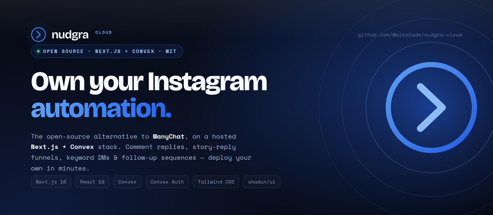

<div align="center">



<br />
<br />

[](./LICENSE)
[](https://www.typescriptlang.org/)
[](https://nextjs.org/)
[](https://react.dev/)
[](https://www.convex.dev/)
[](./CONTRIBUTING.md)

**The open-source alternative to ManyChat for Instagram — on a hosted Next.js + Convex stack.**

Automate comment replies, story-reply funnels, and keyword DMs from a dashboard you own. Deploy your own in minutes, no SaaS fees.

<br />

[](https://pub-7d8033dde9294375a68da6fd9ac0be32.r2.dev/nudgra/nudgra-demo.mp4)
&nbsp;
[](https://docs.nudgra.com/)
&nbsp;
[](https://github.com/MaikoCode/nudgra-oss)

</div>

---

## What is Nudgra Cloud?

Nudgra is an open alternative to ManyChat for Instagram. It focuses on the automations most operators actually use: connect Instagram accounts, receive messages and comments through Meta webhooks, send replies and follow-up sequences, and manage everything from a clean dashboard.

This repository is the **Cloud** build — it runs on [Next.js](https://nextjs.org/) for the dashboard and [Convex Cloud](https://www.convex.dev/) for backend state, auth, scheduling, and Meta webhooks. You deploy it to your own Vercel + Convex project, so there's no Postgres, no webhook server, and no background-job runner to operate yourself.

> **Want to run the database and backend yourself?** Use **[Nudgra OSS](https://github.com/MaikoCode/nudgra-oss)** instead — a separate fully self-hosted TanStack Start + Postgres build of the same product.

📖 Prefer a friendlier, step-by-step walkthrough? The hosted docs at **[docs.nudgra.com](https://docs.nudgra.com/)** mirror this guide in a more readable format.

> 💡 You can also hand this README to a coding agent — Claude Code, Codex, Cursor, or similar — and ask it to walk you through setup. That works especially well for Convex environment variables, Google OAuth, Meta dashboard setup, and reading deployment logs.

Questions or stuck? DM [@Maikoke5](https://x.com/Maikoke5).

## ✨ Features

| | |
| --- | --- |
| 💬 **Comment automations** | Auto-reply to comments on any post, specific posts/reels, or your next post when a comment matches your keywords — then send a DM with tracked link buttons. |
| 📖 **Story-reply funnels** | Turn replies (or reactions) to any story, or one specific story, into the entry point of a follow-up sequence. |
| ⚡ **Keyword DM rules** | Respond automatically when someone DMs a keyword. Set the rule once and Nudgra handles the rest. |
| 🔁 **Follow-up sequences** | Multi-step, delayed DM sequences delivered reliably on Convex scheduled functions. |
| 📥 **Unified inbox** | Read and reply to Instagram conversations from one dashboard. |
| 👥 **Contacts & tags** | A lightweight contact record per person who engages, with automation-applied tags. |
| 🔗 **Tracked links & CTR** | Per-button click tracking so you can see which automations convert. |
| 🪪 **Multi-account** | Connect and switch between multiple Instagram professional accounts. |
| 📊 **Logs & analytics** | Run counts, CTR, and delivery logs for every automation. |
| 🛡️ **Safety guardrails** | Automations respect messaging-window and per-conversation limits, so you stay within Meta's rules. |

## ⚙️ How it works

1. **Connect** an Instagram professional account through Meta's Instagram Business Login — Nudgra runs the OAuth flow and stores account tokens in Convex itself.
2. **Build** comment, story-reply, or keyword-DM automations in the dashboard.
3. **React** — Meta webhooks hit your Convex HTTP endpoint, Nudgra matches triggers, and sends replies, DMs, and link buttons.
4. **Follow up** — delayed sequences, token refreshes, and retries run on the Convex scheduler.
5. **Measure** — watch runs, CTR, conversations, and logs from your dashboard.

## 📌 Good to know

- Nudgra automates **Instagram professional accounts** (business or creator) only.
- **New-follower welcome automations are not possible.** Instagram exposes no public new-follower webhook trigger, so welcome-DM-on-follow cannot be set live. Use a comment, story-reply, or keyword-DM automation instead.
- Your Meta app must be **published** for webhooks to work, and each Instagram account must accept its tester invite (see [Meta / Instagram setup](#-meta--instagram-setup)).
- Meta webhooks point to the **Convex site URL**, not the Next.js app URL. In this repo the webhook route is defined in `convex/http.ts` at `/meta/webhooks`.

## 🧱 Tech stack

| Layer | Choice |
| --- | --- |
| Framework | Next.js 16 (React 19) |
| Backend & data | Convex |
| Auth | Convex Auth (Google sign-in) |
| Scheduling & jobs | Convex scheduled functions |
| Webhooks | Convex HTTP Actions |
| Styling | Tailwind CSS v4 + shadcn/ui |

---

## Table of contents

- [What you need](#what-you-need)
- [Important URLs](#important-urls)
- [Environment variables](#environment-variables)
- [💻 Local development](#-local-development)
- [🚀 Production deployment (Vercel + Convex)](#-production-deployment-vercel--convex)
- [Google OAuth setup](#google-oauth-setup)
- [📷 Meta / Instagram setup](#-meta--instagram-setup)
- [Updating a deployment](#updating-a-deployment)
- [Backup & data](#backup--data)
- [Troubleshooting](#troubleshooting)
- [Useful commands](#useful-commands)
- [Project docs](#-project-docs)
- [Contributing, security & license](#contributing-security--license)

The setup has a few moving parts because Google OAuth, Instagram OAuth, Meta webhooks, and Convex all need to agree with each other. Expect about **15 minutes** if you already have a Convex project and an app domain ready.

## What you need

- A Google account for dashboard sign-in.
- A Convex account for the backend deployment.
- A Meta Developer account.
- An Instagram professional account (business or creator) that you want to automate.
- **For production:** Vercel and a public domain or subdomain for the Next.js app.
- **For local development:** Node.js 24 or newer, Git, and optionally a public tunnel URL for Meta callback testing.

## Important URLs

Replace `https://your-app-domain.com` with your real app domain, for example `https://cloud.nudgra.example.com`.

Replace `https://your-convex-site.convex.site` with the Convex HTTP Actions URL for your deployment. In Convex, the site URL usually ends in `.convex.site`.

| Purpose | URL |
| --- | --- |
| App | `https://your-app-domain.com` |
| Google OAuth redirect URI | `https://your-convex-site.convex.site/api/auth/callback/google` |
| Meta / Instagram OAuth redirect URI | `https://your-app-domain.com/api/meta/callback` |
| Meta webhook callback URL | `https://your-convex-site.convex.site/meta/webhooks` |
| Convex dashboard | `npx convex dashboard` |

> ⚠️ Two URLs commonly trip people up: the **Google OAuth redirect** and the **Meta webhook callback** must both point to the **Convex site URL** (`.convex.site`), not the Next.js app URL. The Meta OAuth redirect is the one exception — it points to the app domain.

## Environment variables

Copy `.env.example` to `.env.local` for local work:

```bash
cp .env.example .env.local
```

In Windows PowerShell:

```powershell
Copy-Item .env.example .env.local
```

Local values usually look like this:

```env
NEXT_PUBLIC_CONVEX_URL=
NEXT_PUBLIC_CONVEX_SITE_URL=

SITE_URL=http://localhost:3000
CONVEX_DEPLOY_KEY=

AUTH_GOOGLE_ID=
AUTH_GOOGLE_SECRET=
NUDGRA_ALLOWED_EMAILS=you@example.com

META_APP_ID=
META_APP_SECRET=
META_VERIFY_TOKEN=
```

Production values are **split** between your Next.js host (Vercel) and Convex.

Set these on **Vercel**:

| Variable | Purpose |
| --- | --- |
| `CONVEX_DEPLOY_KEY` | Lets `npx convex deploy --cmd "npm run build"` deploy the Convex backend during hosted builds |
| `SITE_URL` | Public app origin used by Next.js routes, Meta OAuth callbacks, and tracked links |
| `META_APP_ID` | Meta app ID used by the Next.js connect route |
| `META_APP_SECRET` | Meta app secret used by the Next.js Meta routes |
| `META_VERIFY_TOKEN` | Verify-token presence check for the Meta connect flow |

Set these on the **Convex production deployment**:

| Variable | Purpose |
| --- | --- |
| `AUTH_GOOGLE_ID` | Google sign-in client ID |
| `AUTH_GOOGLE_SECRET` | Google sign-in client secret |
| `NUDGRA_ALLOWED_EMAILS` | Comma-separated Google emails allowed to access this private deployment |
| `META_APP_ID` | Meta app ID |
| `META_APP_SECRET` | Meta app secret |
| `META_VERIFY_TOKEN` | Meta webhook verification token |
| `SITE_URL` | Public app origin used by tracked links and callback-aware backend flows |
| `JWT_PRIVATE_KEY` | Convex Auth signing key |
| `JWKS` | Convex Auth JWKS document |

Generate random tokens with OpenSSL:

```bash
openssl rand -hex 32
```

Or generate one with Node:

```bash
node -e "console.log(require('crypto').randomBytes(32).toString('hex'))"
```

Use a generated value for `META_VERIFY_TOKEN`.

> **Important**
> - `JWT_PRIVATE_KEY` and `JWKS` are required by Convex Auth. Generate them with `npx @convex-dev/auth --prod` — do not handcraft them unless you are following the [Convex Auth manual setup docs](https://labs.convex.dev/auth/setup/manual).
> - `NEXT_PUBLIC_CONVEX_URL` and `NEXT_PUBLIC_CONVEX_SITE_URL` are written by `npx convex dev` locally and injected by `npx convex deploy --cmd "npm run build"` during production builds.
> - `NUDGRA_ALLOWED_EMAILS` is required. If your Google email is not in the allowlist, sign-in is rejected.
> - Keep `SITE_URL` exact. If your app is deployed at `https://cloud.example.com`, do not use a different Vercel preview URL or localhost value in production.

## 💻 Local development

This path is best for dashboard development and UI testing. For a complete Instagram webhook flow, use a deployed Convex site URL and a public app domain or tunnel, because Meta cannot call `localhost`.

### 1. Install dependencies

Install:

- Git
- Node.js 24 or newer
- A Convex account

In a Unix shell (macOS, Linux, or Git Bash):

```bash
git clone https://github.com/MaikoCode/nudgra-cloud.git nudgra-cloud
cd nudgra-cloud
npm install
cp .env.example .env.local
```

In Windows PowerShell:

```powershell
git clone https://github.com/MaikoCode/nudgra-cloud.git nudgra-cloud
cd nudgra-cloud
npm install
Copy-Item .env.example .env.local
```

### 2. Configure local `.env.local`

At minimum, set:

```env
SITE_URL=http://localhost:3000
NUDGRA_ALLOWED_EMAILS=your-google-email@gmail.com
```

Google OAuth is required for normal sign-in. Create Google OAuth credentials using the [Google section below](#google-oauth-setup), then set:

```env
AUTH_GOOGLE_ID=your-google-client-id
AUTH_GOOGLE_SECRET=your-google-client-secret
```

For local Google OAuth, use your **local Convex site URL** as the redirect URI, not the Next.js app URL. `npx convex dev` will print or write the Convex values:

```env
NEXT_PUBLIC_CONVEX_URL=https://your-dev-deployment.convex.cloud
NEXT_PUBLIC_CONVEX_SITE_URL=https://your-dev-deployment.convex.site
```

Then configure Google with:

```text
Authorized JavaScript origin:
http://localhost:3000

Authorized redirect URI:
https://your-dev-deployment.convex.site/api/auth/callback/google
```

For local Meta OAuth or tracked links, set `SITE_URL` to a public tunnel URL instead of `http://localhost:3000`, for example:

```env
SITE_URL=https://your-tunnel.example.com
```

### 3. Run the app

```bash
npm run dev
```

Open <http://localhost:3000>.

Notes:

- The `predev` flow initializes Convex, runs the Convex Auth setup helper once, and opens the Convex dashboard.
- `npm run dev` runs Next.js and `convex dev` together.
- If the Convex Auth setup helper prompts for `SITE_URL`, use the local or tunnel URL you configured.

Useful local commands:

```bash
npm run lint
npm test
npx convex dashboard
npx convex env list
```

## 🚀 Production deployment (Vercel + Convex)

This is the recommended hosted setup:

- Next.js app on **Vercel**.
- Convex backend on **Convex Cloud**.
- Google OAuth for sign-in.
- A Meta app for Instagram OAuth and webhooks.

> Want the database and backend fully self-hosted instead? Use [Nudgra OSS](https://github.com/MaikoCode/nudgra-oss).

### 1. Choose the app domain

Pick the final public URL for the Next.js app, for example `https://your-app-domain.com`, and use that exact value everywhere:

- Next.js host `SITE_URL`
- Convex production `SITE_URL`
- Meta OAuth redirect URI
- Google authorized JavaScript origin
- Any tracked-link testing

If the domain changes later, update all platform settings and redeploy.

### 2. Create the Convex production deployment

1. Create or open your Convex project.
2. Create a production deployment in the Convex dashboard.
3. Generate a production deploy key from the Convex dashboard.
4. Keep the production deployment's `.convex.site` URL handy — you'll need it for Google and Meta.

You can also open the dashboard from the project root:

```bash
npx convex dashboard
```

### 3. Provision Convex Auth on production

Run this from the project root:

```bash
npx @convex-dev/auth --prod
```

When prompted:

- set `SITE_URL` to your public app domain, for example `https://your-app-domain.com`
- let the tool generate and store `JWT_PRIVATE_KEY` and `JWKS`

This prepares the production Convex deployment for Google sign-in and redirects back to your app after auth.

### 4. Configure the Convex production environment

Set the email allowlist and public app origin:

```bash
npx convex env set --prod NUDGRA_ALLOWED_EMAILS your-google-email@gmail.com
npx convex env set --prod SITE_URL https://your-app-domain.com
```

After Google and Meta are configured, also set:

```bash
npx convex env set --prod AUTH_GOOGLE_ID your-google-client-id
npx convex env set --prod AUTH_GOOGLE_SECRET your-google-client-secret
npx convex env set --prod META_APP_ID your-instagram-app-id
npx convex env set --prod META_APP_SECRET your-instagram-app-secret
npx convex env set --prod META_VERIFY_TOKEN your-random-verify-token
```

You can set the same values in the Convex dashboard instead of the CLI.

### 5. Deploy on Vercel

1. Import this repository into Vercel.
2. Set the install command to `npm install`.
3. Set the build command to:

   ```bash
   npx convex deploy --cmd "npm run build"
   ```

4. Set these Vercel environment variables:

   ```env
   CONVEX_DEPLOY_KEY=your-convex-production-deploy-key
   SITE_URL=https://your-app-domain.com
   META_APP_ID=your-instagram-app-id
   META_APP_SECRET=your-instagram-app-secret
   META_VERIFY_TOKEN=your-random-verify-token
   ```

5. Attach your production domain in Vercel.
6. Redeploy after the domain and environment variables are final.

Why the build command matters — it:

- deploys the Convex backend during the build
- typechecks and bundles Convex functions
- injects the correct Convex deployment URLs into the Next.js build

### 6. Smoke test the hosted app

After the first deployment:

1. Open `https://your-app-domain.com`.
2. Sign in with a Google account listed in `NUDGRA_ALLOWED_EMAILS`.
3. Open `/dashboard/account` and connect an Instagram professional account.
4. Confirm the account appears as connected.
5. Send a real test DM, comment, or story reply.
6. Verify that contacts, conversations, automations, and logs update in the dashboard.
7. Verify that tracked links resolve through your app domain.
8. Verify that webhook activity appears in logs.

## Google OAuth setup

Go to the Google Cloud Console and create OAuth credentials for a **web application**.

For production, set:

```text
Authorized JavaScript origin:
https://your-app-domain.com

Authorized redirect URI:
https://your-convex-site.convex.site/api/auth/callback/google
```

For local development, set:

```text
Authorized JavaScript origin:
http://localhost:3000

Authorized redirect URI:
https://your-dev-deployment.convex.site/api/auth/callback/google
```

> The redirect URI uses the **Convex site URL**, not the app domain. This repo uses Convex Auth routes hosted on the Convex site.

If Google asks for an authorized domain, use the root domain, for example `example.com`.

Copy the client ID and secret into Convex:

```bash
npx convex env set --prod AUTH_GOOGLE_ID your-google-client-id
npx convex env set --prod AUTH_GOOGLE_SECRET your-google-client-secret
```

For local development, put the same values in `.env.local` or set them on your Convex dev deployment:

```env
AUTH_GOOGLE_ID=your-google-client-id
AUTH_GOOGLE_SECRET=your-google-client-secret
```

Restart local development after changing auth values:

```bash
npm run dev
```

Redeploy production after changing hosted values:

```bash
npx convex deploy --cmd "npm run build"
```

## 📷 Meta / Instagram setup

Meta's dashboard changes often, so labels may move slightly. The important pieces stay the same: create a Meta app, add Instagram testers, publish the app, configure webhooks, configure Instagram business login, copy the Instagram app credentials into Convex and your Next.js host, and connect the account from Nudgra.

### 1. Create the Meta app

Go to <https://developers.facebook.com/apps/>, sign up if needed, then click **Create App**.

During setup:

- Give the app a name.
- For the use case, select **Manage messaging & content on Instagram**.
- Finish the app creation flow.

### 2. Add Instagram testers

Inside your Meta app dashboard:

1. Go to **App roles**.
2. Click **Roles** (not **Test users**).
3. Click **Add People**.
4. In the modal, choose **Instagram Tester**.
5. Add the Instagram accounts you want to automate with Nudgra.

Then each Instagram account must accept the invite:

1. Open Instagram in a **desktop browser**.
2. Go to **Settings → Website permissions → Apps and Websites → Test invites**.
3. Accept the invite.

> The **Website permissions** area may not appear on mobile, so use Instagram on a computer.

### 3. Add permissions

In the Meta app dashboard:

1. Go to **Use cases**.
2. Open the Instagram use case.
3. Go to **API setup with Instagram login**.
4. In **Add required messaging permissions**, add the permissions Nudgra needs:

```text
instagram_business_basic
instagram_business_manage_messages
instagram_business_manage_comments
```

You do not need to manually generate access tokens in Meta. Nudgra performs the Instagram login flow and stores account tokens in Convex.

### 4. Publish the Meta app

Webhooks require the app to be published for real delivery. For testing your own connected Instagram accounts, you can publish with basic app details.

1. Go to **Publish**.
2. Add a privacy policy URL.
3. Fill any required basic fields.
4. Publish the app.

> For testing, a simple public privacy policy page is enough — for example, a published Notion page.

### 5. Copy Instagram app credentials

Return to your app at <https://developers.facebook.com/apps/>, then:

1. Go to **Use cases**.
2. Click **Customize** or open the Instagram use case.
3. Open **API setup with Instagram login**.
4. Find and copy the **Instagram app ID**.
5. Reveal and copy the **Instagram app secret**.

Put them on the Convex production deployment:

```bash
npx convex env set --prod META_APP_ID your-instagram-app-id
npx convex env set --prod META_APP_SECRET your-instagram-app-secret
npx convex env set --prod META_VERIFY_TOKEN your-random-webhook-verify-token
```

Put the same values on the Next.js host (Vercel):

```env
META_APP_ID=your-instagram-app-id
META_APP_SECRET=your-instagram-app-secret
META_VERIFY_TOKEN=your-random-webhook-verify-token
```

Generate a verify token yourself — any strong random string works:

```bash
openssl rand -hex 32
# or
node -e "console.log(require('crypto').randomBytes(32).toString('hex'))"
```

Redeploy or restart after editing environment variables.

### 6. Configure webhooks

In **API setup with Instagram login**, open **Configure webhooks** and set:

```text
Callback URL: https://your-convex-site.convex.site/meta/webhooks
Verify token: same value as META_VERIFY_TOKEN
```

Click **Verify and save**, then subscribe to these webhook fields:

```text
messages
messaging_postbacks
comments
```

> The webhook callback must point to the **Convex site URL**, not the Next.js app URL. The app expects Instagram webhook events through the Convex HTTP endpoint.

### 7. Configure Instagram business login

In **API setup with Instagram login**, open **Set up Instagram business login** and set:

```text
Redirect URL: https://your-app-domain.com/api/meta/callback
```

Save the redirect URL.

### 8. Connect Instagram in Nudgra

Open your deployment at `https://your-app-domain.com` and sign in with the Google account in `NUDGRA_ALLOWED_EMAILS`. Then:

1. Go to **Dashboard → Account**.
2. Click **Add account**.
3. Complete the Instagram permission screen.
4. Allow profile/media access, comment access, and message access.
5. Confirm the account appears as connected and active.

## Updating a deployment

For Vercel, push to the branch connected to the project and let the build run. The build command redeploys the Convex backend at the same time:

```bash
npx convex deploy --cmd "npm run build"
```

## Backup & data

Nudgra Cloud stores app data in Convex. Use the Convex dashboard and Convex CLI for data inspection, exports, and operational recovery.

Keep a private copy of production environment variables — you'll need them if you recreate the deployment or move the app domain.

Important secrets:

- `JWT_PRIVATE_KEY`
- `JWKS`
- `AUTH_GOOGLE_SECRET`
- `META_APP_SECRET`
- `META_VERIFY_TOKEN`
- `CONVEX_DEPLOY_KEY`

## Troubleshooting

<details>
<summary>Google sign-in says the account is not allowed</summary>

Check that the exact Google email is listed in Convex:

```bash
npx convex env list --prod
```

Set or update the allowlist:

```bash
npx convex env set --prod NUDGRA_ALLOWED_EMAILS you@example.com,backup@example.com
```

For local development, also check `.env.local`.

</details>

<details>
<summary>Google login redirects to the wrong URL</summary>

Check:

```env
SITE_URL=https://your-app-domain.com
```

Verify that the Google OAuth redirect URI uses the **Convex site URL**:

```text
https://your-convex-site.convex.site/api/auth/callback/google
```

Do **not** use `https://your-app-domain.com/api/auth/callback/google`. This repo uses Convex Auth routes on the Convex site URL.

</details>

<details>
<summary>Meta webhook verification fails</summary>

Check that:

- `META_VERIFY_TOKEN` in Convex exactly matches the token entered in Meta.
- `https://your-convex-site.convex.site/meta/webhooks` is reachable publicly.
- Convex has been redeployed after code changes.
- The Meta app is published when testing real delivery.
- The subscribed webhook fields are `messages`, `messaging_postbacks`, and `comments`.

```bash
npx convex logs --prod
npx convex env list --prod
```

A plain browser request to the webhook URL may return `403` because it is missing Meta's verification query parameters. That still proves the route is reachable — Meta's **Verify and save** button is the real webhook verification.

</details>

<details>
<summary>Meta webhooks are verified but no events appear</summary>

Check that:

- The Meta webhook callback points to the Convex URL, not the app URL.
- The connected Instagram account accepted the tester invite during development.
- The app has the required Instagram permissions.
- The app is in Live mode for real users.
- The Instagram account is professional (business or creator).
- The connected account still appears active in `/dashboard/account`.

</details>

<details>
<summary>Instagram account does not appear during connection</summary>

Check that:

- The Instagram account accepted the tester invite.
- The invite was accepted from Instagram on desktop.
- The app has the required Instagram permissions.
- The Instagram account is professional (business or creator).
- You are logged into the correct Instagram account when authorizing.
- `SITE_URL` matches the Meta redirect URL exactly.

</details>

<details>
<summary>The connect button returns a Meta config warning</summary>

Set these values on **both** Convex production and the Next.js host, then redeploy or restart:

```env
META_APP_ID=your-instagram-app-id
META_APP_SECRET=your-instagram-app-secret
META_VERIFY_TOKEN=your-random-webhook-verify-token
```

</details>

<details>
<summary>Tracked links use the wrong host</summary>

Check Convex production:

```bash
npx convex env get --prod SITE_URL
```

Set it to the public app domain and redeploy:

```bash
npx convex env set --prod SITE_URL https://your-app-domain.com
```

</details>

## Useful commands

```bash
npm run dev                                # Next.js + convex dev together
npm run build
npm run start
npm run lint
npm test
npx convex dev
npx convex deploy --cmd "npm run build"
npx convex dashboard
npx convex logs --prod
npx convex env list --prod
npx @convex-dev/auth --prod
```

## 📚 Project docs

- [Design](./DESIGN.md)
- [Product Overview](./docs/product-overview.md)
- [Technical Architecture](./docs/technical-architecture.md)
- [Meta Setup Notes](./docs/meta-setup.md)
- [Contributing](./CONTRIBUTING.md)
- [Security Policy](./SECURITY.md)
- [Trademark Policy](./TRADEMARKS.md)

## Contributing, security & license

- **Contributing** — see [CONTRIBUTING.md](./CONTRIBUTING.md). Bug fixes, tests, docs, and UI polish are all welcome.
- **Security** — please report vulnerabilities privately. See [SECURITY.md](./SECURITY.md).
- **License** — [MIT](./LICENSE). The MIT license does not grant rights to the `Nudgra` name, logo, or branding. If you fork or reuse the code for your own product, rename it and replace the branding; see [TRADEMARKS.md](./TRADEMARKS.md).

### Related references

- [Convex hosting docs](https://docs.convex.dev/production/hosting/)
- [Convex CLI deploy docs](https://docs.convex.dev/cli)
- [Convex Auth manual setup](https://labs.convex.dev/auth/setup/manual)
- [Convex Auth Google OAuth setup](https://labs.convex.dev/auth/config/oauth/google)
- [Google OAuth client rules](https://support.google.com/cloud/answer/15549257)

<div align="center">
<br />

If Nudgra is useful to you, consider **starring the repo** ⭐ — it genuinely helps.

<sub>Built with Next.js · Convex · Convex Auth · Tailwind CSS · shadcn/ui</sub>

</div>
