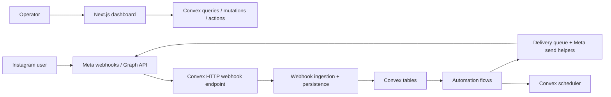

# Nudgra Technical Architecture

For product context, see [About Nudgra](../ABOUT_PROJECT.md) and [Product Overview](./product-overview.md).

## Current State

This repository is a working Instagram automation product, not a starter template.

Today it includes:

- Google sign-in for operators through Convex Auth
- Workspace-scoped Instagram account connection through Meta OAuth
- Keyword DM automations
- Comment automations
- Story reply automations
- Contacts, conversations, logs, and tracked-link reporting
- Convex schedulers for retries, follow-ups, and delayed work

## System Shape



## Runtime Responsibilities

### Next.js app

- Renders the operator dashboard under `app/dashboard/**`
- Handles account-connection callback routes under `app/api/meta/**`
- Uses Convex React hooks for authenticated reads and writes
- Keeps most UI logic in `components/dashboard/**` and `lib/*-ui.ts`

### Convex backend

- Stores all domain state in `convex/schema.ts`
- Owns workspace/auth/account permissions in `convex/lib/auth.ts`
- Exposes feature APIs from modules such as `accounts.ts`, `contacts.ts`, `dashboard.ts`, and `automations/**`
- Handles webhook verification and ingestion through `convex/http.ts` and `convex/meta/webhooks.ts`
- Schedules follow-ups, retries, and sequence steps

### Meta integration

- OAuth token exchange and account sync live in `convex/meta/**`
- Webhooks are treated as the source of truth for inbound activity
- Outbound delivery uses shared send helpers plus delivery-attempt logging

## Core Domain Model

The main tables in `convex/schema.ts` are:

| Table | Purpose |
| --- | --- |
| `users` | dashboard operators |
| `workspaces` | account grouping and ownership boundary |
| `instagramAccounts` | connected Instagram professional accounts |
| `contacts` | Instagram users who interact with an account |
| `conversations` | per-contact thread state and message-window timestamps |
| `messages` | normalized inbound and outbound message history |
| `automationRules` | keyword and legacy story-reply DM rules |
| `commentAutomations` | comment-triggered DM workflows |
| `storyAutomations` | story-reply workflows |
| `automationRuleSessions` | per-contact rule progression |
| `commentAutomationSessions` | per-contact comment automation progression |
| `storyAutomationSessions` | per-contact story automation progression |
| `deliveryAttempts` | outbound send attempts and Meta failures |
| `webhookEvents` | parsed inbound webhook items with dedupe keys |
| `webhookReceipts` | raw webhook POST receipts and parser outcome |
| `contactAutomationMemberships` | contact-to-automation history for read models |
| `contactEmails` | emails captured in automations |
| `sequenceDefinitions` / `sequenceEnrollments` | delayed follow-up sequences |
| `tags` / `contactTags` | automation-applied tagging |

## Feature Boundaries

### Accounts and auth

- `convex/accounts.ts` owns selected-account context, connection lifecycle, and workspace-scoped account reads.
- `convex/lib/auth.ts` is the main guardrail for workspace access checks.

### Automations

- `convex/automations/rules.ts` manages CRUD for keyword DM automations.
- `convex/automations/commentAutomations.ts` manages comment automation CRUD and serialization.
- `convex/automations/storyAutomations.ts` manages story automation CRUD and serialization.
- `convex/automations/*Flow.ts` owns runtime session progression after a match occurs.
- `convex/automations/sessionShared.ts` contains the shared follow-gate, email extraction, tracked-link, and guardrail helpers used across rule, comment, and story flows.

### Meta/webhook pipeline

- `convex/meta/webhooks.ts` is the ingestion entry point.
- The ingestion flow is split into:
  - webhook receipt parsing and account matching
  - contact/conversation persistence
  - message recording
  - active automation-session continuation
  - trigger matching and side effects
- Outbound sends and policy-aware delivery live in `convex/meta/sendHelpers.ts`, `convex/meta/sendActions.ts`, and `convex/meta/deliveryPolicy.ts`.

### Read models

- `convex/lib/readModels.ts` centralizes higher-level contact/conversation serialization for the dashboard.
- `convex/contacts.ts` uses account-scoped read paths for the contacts view.
- `convex/dashboard.ts` powers the top-level dashboard overview and logs.

## Inbound Flow

1. Meta calls the Convex webhook endpoint.
2. `convex/meta/webhooks.ts` stores a raw receipt in `webhookReceipts`.
3. Each messaging item is deduped into `webhookEvents`.
4. The matching contact and conversation are upserted.
5. The inbound message is recorded in `messages`.
6. Any active automation session for that conversation is advanced first.
7. If no active session consumes the interaction, live story automations or rules are matched.
8. Matching automations may apply tags, start sessions, and optionally enroll sequences.

## Outbound Flow

1. Automation flows decide what message or button batch to send.
2. Shared guardrail helpers enforce per-session and per-conversation limits.
3. Send helpers enqueue delivery attempts and talk to Meta.
4. Tracked links are stored before outbound buttons are rewritten to app redirect URLs.
5. Follow-up jobs are scheduled only when a workflow is still eligible.

## UI Structure

The automation editors follow the same general pattern:

- route page does account lookup, loading states, and submit/toggle actions
- shared dashboard component renders the form or detail UI
- `lib/*-ui.ts` contains local normalization, validation, and summary helpers

This keeps the page files thin and makes contributor changes safer.

## Important Constraints

- All reads and writes are workspace-scoped through the selected Instagram account.
- Webhook deliveries must be idempotent.
- Automated sends must respect messaging-window and safety-guardrail rules.
- Public function names and schema shape are treated as stable unless a migration is planned.

## Repo Map

```text
app/
  dashboard/
  api/meta/
components/dashboard/
convex/
  accounts.ts
  contacts.ts
  dashboard.ts
  messages.ts
  meta/
  automations/
  lib/
  schema.ts
docs/
tests/
```

## Testing Strategy

The repo uses Vitest for backend and UI helper coverage.

Key test areas today:

- rule, comment, and story automation session flows
- tracked-link routes
- dashboard/account scoping
- contacts inbox rendering and webhook persistence
- multi-account isolation

When changing automation behavior, contributors should verify both `npm run lint` and `npm test`.
