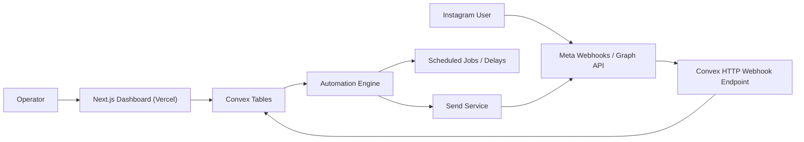

# Nudgra Technical Architecture

For product context, scope, and goals, see [About Nudgra](../ABOUT_PROJECT.md).
For the intended visual system and UI constraints, see [Design](../DESIGN.md).

## Current Baseline

As of April 7, 2026, this repo is still a Convex starter application:

- `app/page.tsx` is a demo screen
- `convex/schema.ts` only contains auth tables plus a `numbers` table
- `convex/myFunctions.ts` is sample code
- Convex Auth password login is enabled for dashboard access

That matters because the documentation below is a target architecture, not a description of an already-built system.

## Reality Check On "Self-Hosted"

The product idea says "deploy once on Vercel and run it yourself." The current implementation direction is:

- Next.js app in your own Vercel account
- `shadcn` as the frontend component system, with components added only when needed
- Convex as the database, function runtime, and scheduler

That is operator-controlled, but not strictly self-hosted end-to-end. If strict self-hosting is non-negotiable, replace Convex with a self-hosted backend before going deeper into product work. If the real goal is "no ManyChat subscription and full app ownership," the current stack is still viable.

## Recommended Architecture



## Platform Choice

### Recommended Path For MVP

Use the Instagram API with Instagram Login.

Why:

- Meta's current Instagram Login flow does not require a Facebook Page to be linked
- it uses the current `instagram_business_*` scope names
- it fits the single-account, self-operated MVP better

### Fallback Path

Use the older Facebook Login / Messenger Platform path only if you find a feature gap that blocks the MVP. That path still matters, but it adds Page linkage and a more complex token model.

## Meta Constraints That Shape The Architecture

- Only Instagram professional accounts are supported
- A user must initiate the conversation before Nudgra can automate inside that thread
- Standard access is enough for accounts you own or manage and add to the app; advanced access is required for third-party customer accounts
- App testers in development must hold the right app/account roles
- Group messaging is not supported
- Old requests older than 30 days may disappear from API results
- Automated messaging must respect the standard 24-hour window; the `HUMAN_AGENT` path is explicitly for human support, not automation

These constraints mean Nudgra must be event-driven, policy-aware, and careful about what it promises in the UI.

## Recommended Convex Responsibilities

### HTTP Endpoints

- Meta webhook verification
- Meta webhook ingestion
- optional OAuth callback helpers if you keep the auth exchange inside Convex

### Database

- account records
- token metadata
- contacts
- conversations
- inbound and outbound messages
- automation rules
- sequence enrollments
- audit events and failures

### Scheduling

- delayed sequence steps
- retries for transient Graph API failures
- cleanup and token refresh jobs

### Internal Services

- send-message service with policy checks
- webhook deduplication
- rule evaluation
- tagging and sequence enrollment

## Proposed Data Model

The current `numbers` demo table should be replaced with domain tables similar to these:

| Table | Purpose |
| --- | --- |
| `users` | dashboard users from Convex Auth |
| `workspaces` | operator-owned workspace metadata |
| `instagramAccounts` | connected Instagram professional accounts |
| `instagramAuthSessions` | token metadata, scopes, refresh state |
| `contacts` | external Instagram users the account has interacted with |
| `conversations` | conversation-level state and timestamps |
| `messages` | inbound and outbound message records |
| `automationRules` | keyword rules and trigger configuration |
| `sequenceDefinitions` | reusable follow-up flows |
| `sequenceEnrollments` | contact enrollment and next step state |
| `tags` | workspace-defined tags |
| `contactTags` | join table between contacts and tags |
| `webhookEvents` | raw inbound event log and dedupe keys |
| `deliveryAttempts` | outbound delivery attempt log |

Keep the schema normalized. Do not store growing message histories, tags, or sequence step lists as unbounded arrays on a single document.

## Suggested Convex Module Layout

```text
convex/
  auth.ts
  auth.config.ts
  http.ts
  schema.ts
  accounts.ts
  contacts.ts
  conversations.ts
  messages.ts
  tags.ts
  dashboard.ts
  meta/
    oauth.ts
    webhooks.ts
    send.ts
    tokens.ts
  automations/
    rules.ts
    sequences.ts
    scheduler.ts
```

## Critical Engineering Decisions

### 1. Webhook Idempotency

Meta can retry webhook deliveries. Store a dedupe key and raw payload before doing business logic.

### 2. Policy-Safe Sending

Before every outbound automated message, validate that the thread is still inside an allowed automation window. Do not rely on UI assumptions.

### 3. Raw Event Storage

Store raw webhook payloads for debugging. Instagram automation failures are difficult to diagnose without payload history.

### 4. Queue Outbound Sends

Do not send directly from every webhook handler path. Queue the send job so retries, logging, and backoff are consistent.

### 5. Token Handling

Do not scatter token logic across the app. Centralize token reads, refresh rules, expiration tracking, and reconnect flows.

## Dashboard Surface For MVP

The first useful dashboard only needs:

- onboarding and account connection
- rule list and rule editor
- contacts view
- conversation log
- failed delivery log
- sequence enrollment status

## Recommended Next Code Changes

1. Replace the demo `numbers` schema with Nudgra domain tables.
2. Replace `convex/myFunctions.ts` with real domain modules.
3. Add webhook routes in `convex/http.ts`.
4. Replace the demo homepage with onboarding and rule management UI.
5. Keep Convex Auth for the operator dashboard unless product requirements force an external auth provider.

## Sources

- [Meta official Postman profile](https://www.postman.com/meta/)
- [Meta official Instagram API workspace overview](https://www.postman.com/meta/instagram/overview)
- [Instagram API documentation](https://www.postman.com/meta/instagram/documentation/6yqw8pt/instagram-api)
- [Subscribe to webhooks](https://www.postman.com/meta/instagram/request/xqn84vq/subscribe-to-webhooks)
- [Messaging reply to story webhook](https://www.postman.com/meta/instagram/request/f2smkqi/messaging-reply-to-story-webhook)
- [Create Ice Breakers](https://www.postman.com/meta/instagram/request/fx7tg37/create-ice-breakers)
- [Messenger Platform Instagram Getting Started](https://developers.facebook.com/docs/messenger-platform/instagram/get-started)
